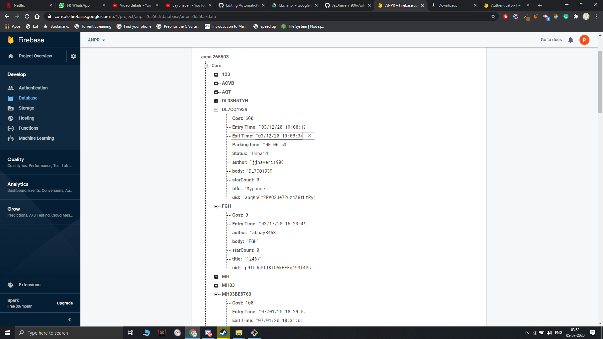
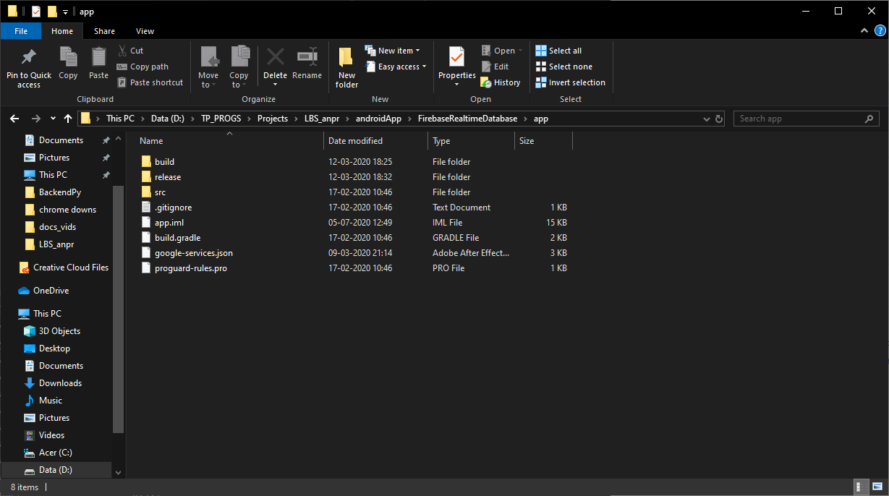

# AutomaticParkingSystemANPR

## Demo yt vid: - 
[Automatic Number Plate Recognition system - Automated Parking](https://www.youtube.com/watch?v=i64AUqCuKV8&feature=youtu.be)

## Steps to run: -
1) Download [THIS](https://drive.google.com/file/d/10lYoIKufiyKaw570UvLbRHbUY6YGYlht/view?usp=sharing) and add this to BackendPy folder.
2) Firebase Setup: -
   - Create a new project in firebase.
   - Add app android
   - Follow the steps given there. ( package name for this app `com.example.database`)
   - Create a new database( test mode )
   - Download the json file and use it to build a database on firebase.(import json option). It should then look something like this: -

3) Android Stuff: -
   - Open the android project in android studio.
   - tools->firebase->realtime data base-> connect to your firebase.
   - Follow the steps given there.
   - After everything, this file(google-services.json) should have been added in the app folder. Like This: - 
4) Install requirements.txt for the backend python part.
5) Install the app on phone/emulator.
6) Tesseract Ocr stuff: -
   - Download and install [this](https://drive.google.com/file/d/1QojD9grZKxbMUceP3d6ckwn11yGuefYe/view?usp=sharing) anywhere on your computer
   - Go to line number 88 in video_final.py
   - copy path till your tesseract.exe and paste it there(Line 88). Path should look like this `D:\\softwares\\Tesseract-ocr\\tesseract.exe`
7) Go to line number 84 and 85 and give a path to store temporary frames of the video being processed.
8) Open video_final.py and on line number 235(with ui) or on 246(without ui) give path to a video or keep path = 0 to activate webcam( use a printed number plate )
  [Sample video](https://drive.google.com/file/d/1QL5nR2pNM71CKH2vehXpEgiqdH6SAAho/view?usp=sharing)
9) Now inside the app, In the Advance(auth) button, select the floating button and add your number plate there.
10) To run without the PyQt5 ui directly run video_final.py and enter 1 for entry, then 0 for exit.
11) To run with ui, Run the design.py code.

## Team X Æ A-4
Jay Jhaveri: https://github.com/JayJhaveri1906

Prem Chhabria: https://github.com/premchhabria

Abhay Gupta: https://github.com/abhay8463

Sahil Lotya: https://github.com/sahillotya

Rahul Koli: https://github.com/rahul2429

Prasad Govekar: https://github.com/govekarmohit
